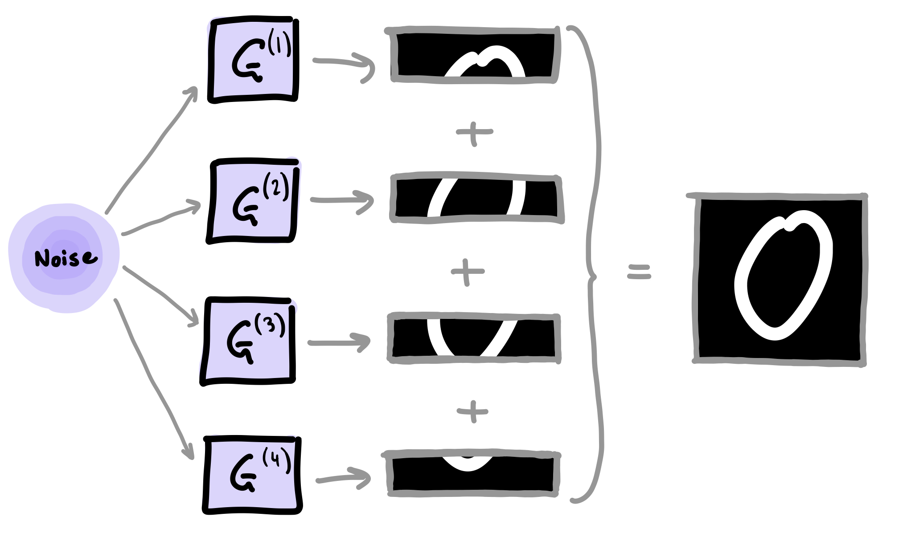

# Quantun-GANs (Pennylane)

This notebook explores quantum GANs to generate hand-written digits of zero. We re-create one of the quantum GAN methods called the patch method. This method uses several quantum generators, with each sub-generator, $G^{(i)}$, responsible for constructing a small patch of the final image. The final image is contructed by concatenting all of the patches together as shown below:

